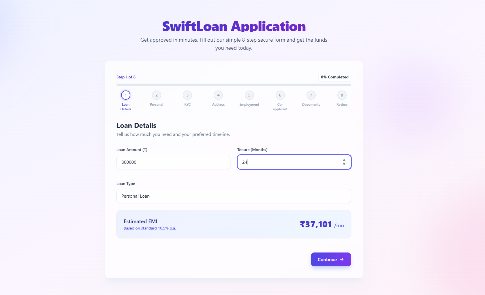
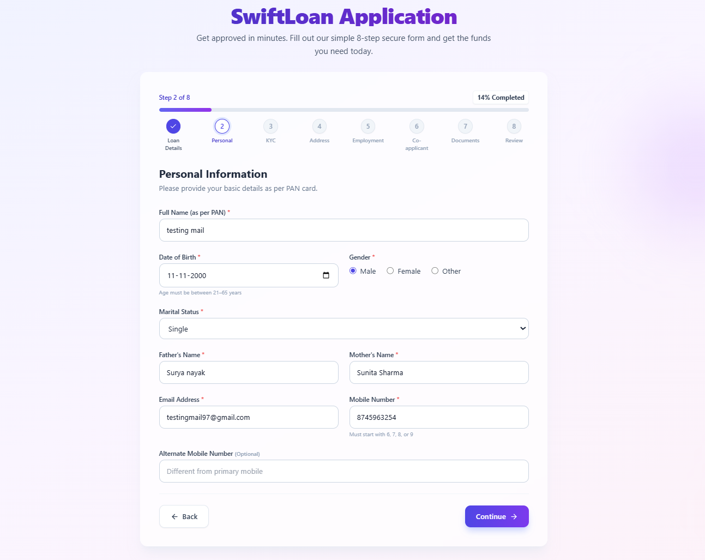
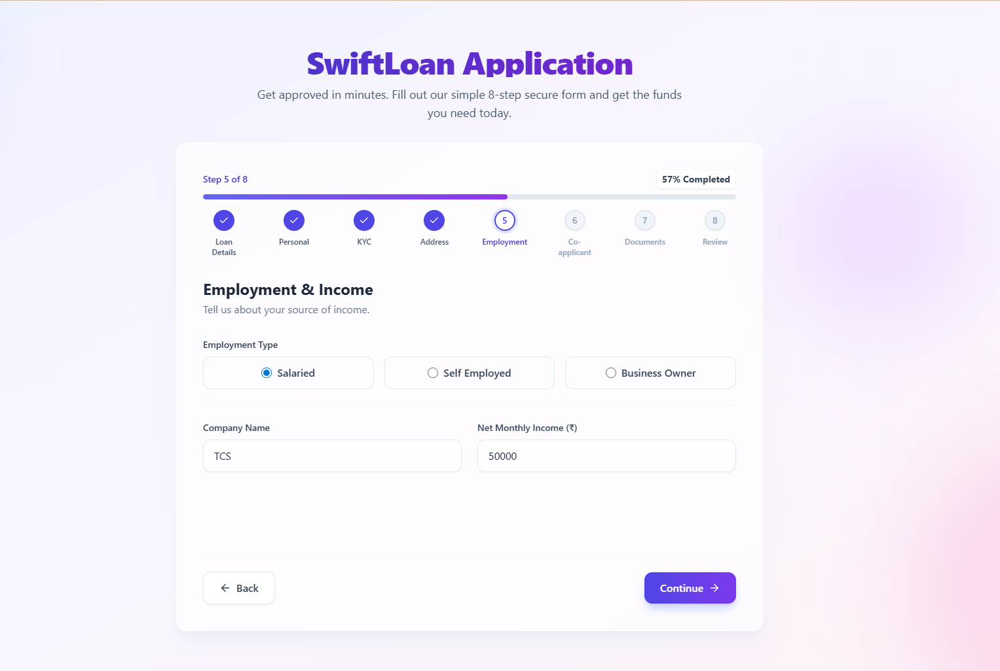
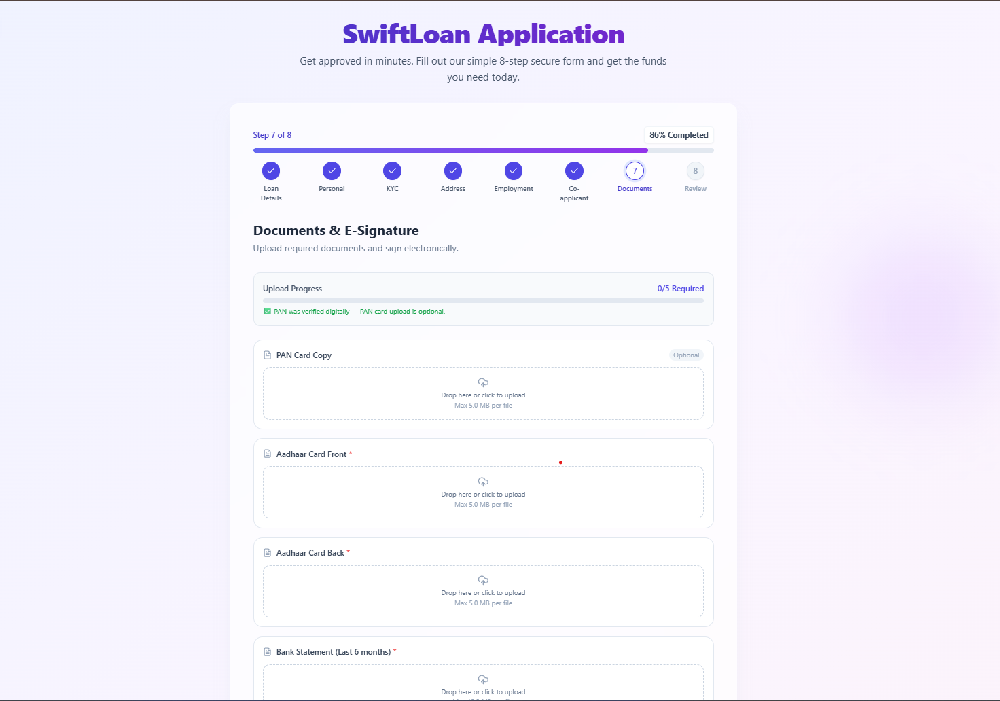
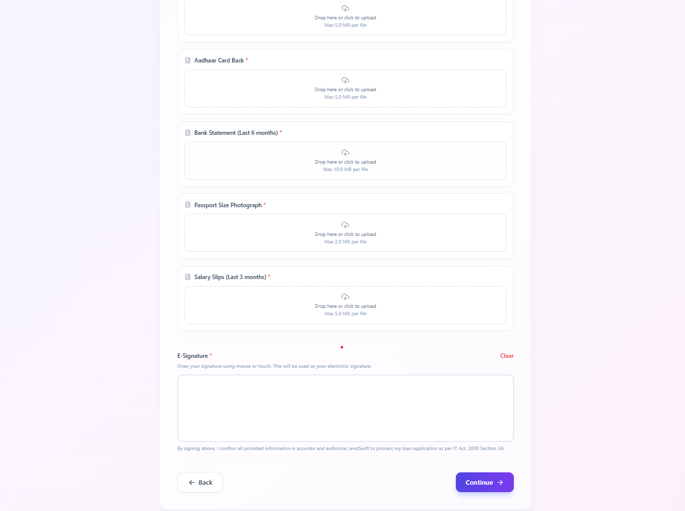
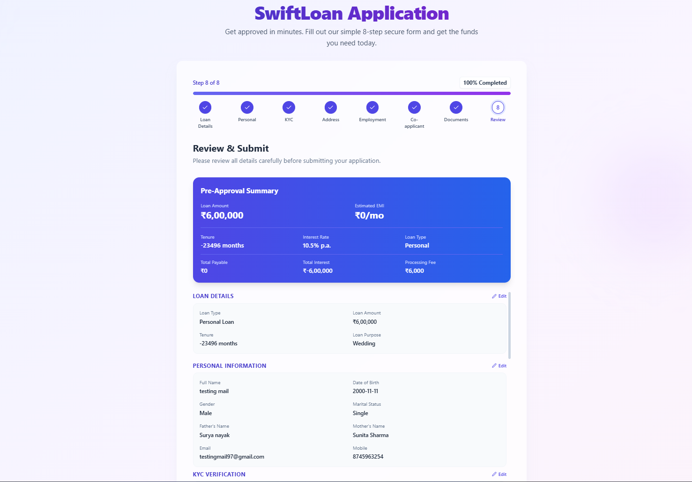
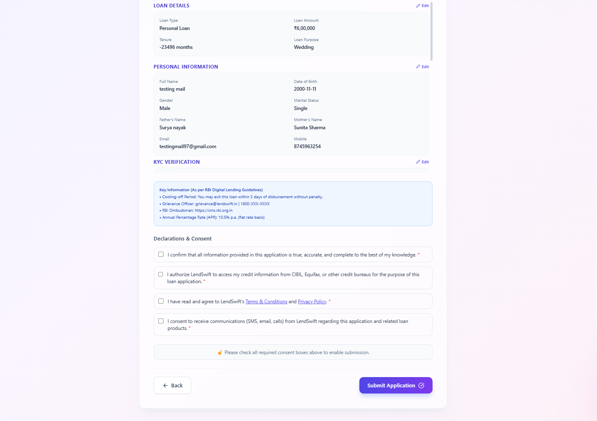

# SwiftLoan Application — Multi-Step Loan Application Form

A production-grade, 8-step multi-step loan application form built for **SwiftLoan**, a fictional Indian digital lending startup (RBI-registered NBFC). Simulates a real-world fintech onboarding flow with real-time validation, conditional field rendering, document upload with client-side compression, e-signature capture, AES-256-GCM encrypted auto-save, and a pre-approval summary generator compliant with RBI Digital Lending Guidelines (September 2022).

---

## Live Demo & Source Code

- **Live Demo:** [https://loan-web-two.vercel.app/](https://loan-web-two.vercel.app/)
- **GitHub Repository:** [https://github.com/KartikGS1211/loan-web](https://github.com/KartikGS1211/loan-web)

---

## Screenshots

| Step                   | Preview                                                                       |
| ---------------------- | ----------------------------------------------------------------------------- |
| Step 1 — Loan Details  |                                        |
| Step 2 — Personal Info |                                       |
| Step 5 — Employment    |                                          |
| Step 7 — Documents     |   |
| Step 8 — Review        |         |

---

## Features

### Core Form Engineering

- **8-Step Dynamic Wizard** — Loan Details → Personal Info → KYC → Address → Employment → Co-Applicant → Documents → Review
- **Conditional Step Routing** — Co-Applicant step (Step 6) appears dynamically per PDF Section B2.1:
  - Home Loan → **Always shown**
  - Personal Loan > ₹5,00,000 → Shown
  - Personal Loan ≤ ₹5,00,000 → Skipped
  - Business Loan > ₹20,00,000 → Shown
  - Business Loan ≤ ₹20,00,000 → Skipped
- **13+ Cross-Step Validation Dependencies** — e.g., Employment Type (Step 5) determines document requirements (Step 7); DOB (Step 2) constrains max tenure (Step 1); Loan Amount (Step 1) triggers Co-Applicant (Step 6)
- **Progressive Disclosure** — Conditional fields render based on prior selections (Residence Type, Employment Type, Loan Type, Years at Address)
- **Wizard Pattern with Step Registry** — Wizard handles orchestration; each step handles its own UI and local validation; central Zustand store handles cross-step state

### Validation & Security (PDF Section C3)

- **Schema-Based Validation** — Centralized Zod schemas per step with `superRefine` for cross-field and cross-step rules
- **PAN Validation** — Format check (AAAAA9999A) + 4th character entity type validation:
  - `P` = Individual (Personal & Home Loans)
  - `P`, `C`, `F` = Individual / Company / Firm (Business Loans)
- **Aadhaar Verhoeff Checksum** — Full 3-table Verhoeff algorithm (multiplication table d, permutation table p, inverse table inv) — not just 12-digit length check
- **Verification Simulation** — 1.5s API delay with spinner, green ✓ Verified badge on success, red ✗ on failure
- **Block on Unverified** — Cannot proceed past Step 3 without both PAN and Aadhaar verified + Aadhaar consent
- **AES-256-GCM Encryption** — All auto-saved draft data encrypted via Web Crypto API (`window.crypto.subtle`) before writing to localStorage — plain JSON never stored
- **PII Masking** — PAN and Aadhaar masked in UI (show last 4 characters only after entry)
- **No PII in console.log** — Production builds suppress sensitive field logging

### Auto-Save & State Persistence (PDF Section A1.5 + C3.4)

- **Encrypted Auto-Save** — Form state serialised to JSON, encrypted with AES-256-GCM, written to localStorage every 30 seconds
- **Storage Key Format** — `lendswift_draft_[loanType]` with metadata: `{ version, timestamp, step, loanType }`
- **72-Hour TTL** — Drafts older than 72 hours auto-purged on page load (data minimisation compliance)
- **Resume Modal** — On page load, if valid draft found: "You have a saved [Loan Type] application. Resume or Start Fresh?"
- **Corruption Detection** — Corrupted / tampered localStorage data detected via schema validation → Start Fresh automatically
- **Draft Cleared on Submit** — localStorage entry removed after successful final submission

### Indian Regulatory Compliance — RBI Digital Lending Guidelines (PDF Section A3)

- **Data Minimality** — Only fields necessary for the lending purpose collected
- **Explicit Consent** — 4 separate, clearly labelled consent checkboxes — none pre-ticked:
  1. Accuracy of information
  2. CIBIL / Equifax credit score check authorisation
  3. Terms & Conditions agreement
  4. Communications consent
- **Aadhaar Consent** — Separate explicit checkbox with Aadhaar Act 2016 reference
- **Key Fact Statement (KFS)** — Pre-approval summary card showing: Loan Amount, Tenure, Interest Rate, Estimated EMI, Total Cost of Borrowing, Processing Fee — shown before final submission
- **Cooling-Off Period Disclosure** — Right to exit within 3 days without penalty (Step 8)
- **Grievance Redressal** — Nodal grievance officer details + RBI Ombudsman escalation path (Step 8)

### EMI & Financial Calculations (PDF Section C3.3)

- **Standard Reducing-Balance EMI Formula** — `EMI = P × r × (1+r)^n / ((1+r)^n – 1)`
  - P = Principal, r = Monthly interest rate (annual / 12 / 100), n = Tenure in months
- **Type-Specific Interest Rates** (fixed for simulation):
  - Personal Loan: **10.5% p.a.**
  - Home Loan: **8.5% p.a.**
  - Business Loan: **14% p.a.**
- **Total Cost of Borrowing** — `(EMI × n) – P`
- **Processing Fee** — 1% of loan amount (minimum ₹2,000 | maximum ₹25,000)
- **Indian Number Formatting** — ₹10,50,000 (not ₹1,050,000) via `toLocaleString("en-IN")`
- **EMI-to-Income Ratio Warning** — Alert shown if EMI > 50% of combined monthly income (primary + co-applicant); extra consent required to proceed
- **Live EMI Preview** — Shown on Step 1 as user types amount and tenure

### Address & PIN Code (PDF Section A3.3)

- **PIN Code Auto-Fill** — 6-digit PIN lookup auto-fills city, state, and post office name from static JSON dataset
- **State-PIN Mismatch Warning** — Warning shown if manually edited state doesn't match PIN-derived state
- **Separate Current & Permanent Address** — "Same as current address" checkbox copies all fields
- **Previous Address Section** — Shown if years at current address < 1 year
- **Residence Type Conditional** — Rent amount field appears only when "Rented" selected

### Document Upload & E-Signature (PDF Section A1.6 + A1.7 + C4)

- **Conditional Document Requirements** — Based on loan type + employment type:
  - All types: PAN card, Aadhaar (front + back), Bank statement (6 months), Photograph
  - Salaried: Salary slips (last 3 months)
  - Self-Employed / Business Owner: ITR (last 2 years)
  - Home Loan: Property documents
  - Business Loan: Business Registration Certificate + GST Returns (4 quarters)
- **PAN Verified → PAN Upload Optional** — Cross-step dependency from Step 3
- **Client-Side Image Compression** — Canvas API: max 1200px width, quality 0.7 initial, recursive reduction by 0.1 until blob ≤ 2MB or quality reaches 0.3. Original vs compressed size shown to user. PDF files not compressed.
- **Drag-and-Drop Upload** — via React Dropzone with file type + size validation
- **E-Signature Canvas** — Mouse + touch support, Clear button, base64 PNG export, non-empty validation, responsive for mobile viewports
- **Document Checklist** — Upload status per document (pending / uploaded)

### Accessibility — WCAG 2.1 AA (PDF Section B4.2)

- All inputs have associated `<label>` elements (not just placeholder text)
- Error messages use `aria-live="polite"` and `role="alert"`
- Focus moves to first input on step transition
- Keyboard-only navigation: Tab, Shift+Tab, Enter, Space, Arrow keys
- Colour contrast minimum 4.5:1 for normal text, 3:1 for large text
- Touch targets minimum 44×44px on mobile
- Progress indicator announces step position via `aria-label`

---

## 🛠 Tech Stack

| Category     | Technology                                                |
| ------------ | --------------------------------------------------------- |
| Core         | React 18 + Vite                                           |
| Form State   | React Hook Form (`useForm`, `useFormContext`, `useWatch`) |
| Validation   | Zod + `@hookform/resolvers/zod`                           |
| Global State | Zustand (no `persist` middleware — manual encrypted save) |
| Styling      | Tailwind CSS (utility-first, mobile-first)                |
| Encryption   | Web Crypto API — AES-256-GCM (`window.crypto.subtle`)     |
| File Upload  | React Dropzone                                            |
| E-Signature  | react-signature-canvas                                    |
| Icons        | Lucide React                                              |
| Testing      | Cypress E2E (v13+)                                        |

---

## Project Structure

```text
src/
 ├── App.jsx                        # Background wrapper & main entry point
 ├── index.css                      # Tailwind directives + glassmorphism utilities
 ├── components/
 │    ├── common/                   # Reusable: Input, Select, FileUpload, SignaturePad
 │    └── wizard/
 │         ├── Wizard.jsx           # Main controller: schemas, routing, auto-save, resume modal
 │         ├── ProgressBar.jsx      # Step progress indicator with aria-label
 │         ├── StepNavigation.jsx   # Back / Continue / Submit buttons
 │         ├── StepRenderer.jsx     # Renders current step component by index
 │         └── SuccessScreen.jsx    # Post-submission: UUID reference number + summary
 ├── hooks/
 │    └── useFormStore.js           # Zustand store + saveDraft / loadDraft / clearDraft helpers
 ├── schemas/
 │    └── validationSchema.js       # All 8 Zod schemas + Verhoeff + PAN algorithms
 ├── steps/
 │    ├── Step1LoanDetails.jsx      # Loan type, amount, tenure, purpose, referral code, EMI preview
 │    ├── Step2PersonalInfo.jsx     # fullName, DOB (21–65), gender, father/mother name, phone
 │    ├── Step3KYC.jsx              # PAN + Aadhaar verify simulation, Voter ID, Passport (Home > 50L)
 │    ├── Step4Address.jsx          # PIN code lookup, residence type, permanent address copy
 │    ├── Step5Employment.jsx       # Salaried / Self-Employed / Business Owner dynamic sub-forms
 │    ├── Step6CoApplicant.jsx      # Conditional step — co-applicant PAN, income, consent, signature
 │    ├── Step7Documents.jsx        # Conditional uploads + Canvas image compression + e-signature
 │    └── Step8Review.jsx           # KFS card, EMI ratio warning, 4 consents, RBI disclosures, submit
 └── utils/
      ├── emiCalculator.js          # EMI formula, total cost, processing fee, Indian number formatting
      └── encryption.js             # AES-256-GCM encrypt / decrypt via Web Crypto API
```

---

## Getting Started

### Prerequisites

- Node.js v18+
- npm

### Installation

```bash
# Clone the repository
git clone https://github.com/KartikGS1211/loan-web.git
cd loan-web

# Install all dependencies
npm install

# Start development server
npm run dev
```

App runs at `http://localhost:5173/`

### Build for Production

```bash
npm run build
npm run preview
```

---

## Running Tests

```bash
# Open Cypress interactive UI
npx cypress open

# Run all tests headlessly in terminal
npx cypress run
```

### Test Coverage — 20 E2E Tests (PDF minimum: 15)

| #   | Test                                                     | Priority |
| --- | -------------------------------------------------------- | -------- |
| 1   | App loads and shows Step 1 — Loan Details                | P0       |
| 2   | Step 1 validation errors — amount below minimum          | P0       |
| 3   | EMI preview displays on Step 1                           | P0       |
| 4   | Navigate to Step 2 with valid Step 1 data                | P0       |
| 5   | Step 2 field validation — fullName, email, DOB           | P0       |
| 6   | Skip Co-Applicant — Personal Loan ≤ ₹5,00,000            | P0       |
| 7   | Show Co-Applicant — Personal Loan > ₹5,00,000            | P0       |
| 8   | Employment type toggle — Salaried ↔ Self-Employed fields | P0       |
| 9   | Auto-save + encrypted resume modal on reload             | P0       |
| 10  | Progress bar visible and updates                         | P1       |
| 11  | Document upload in Step 7                                | P0       |
| 12  | Signature pad visible in Step 7                          | P1       |
| 13  | Reach Review step (Step 8)                               | P0       |
| 14  | Rapid clicking — no state corruption                     | P1       |
| 15  | URL step skip prevention (`?step=5` ignored)             | P1       |
| 16  | Home Loan always shows Co-Applicant regardless of amount | P0       |
| 17  | Business Loan > ₹20,00,000 shows Co-Applicant            | P1       |
| 18  | PAN 4th character entity type validation                 | P0       |
| 19  | Aadhaar Verhoeff checksum rejection                      | P0       |
| 20  | Age < 21 years DOB rejection                             | P0       |

---

## Architecture Decisions

### Why Wizard Pattern with Step Registry?

The Wizard component maintains a step registry (ordered schemas array) and handles all orchestration — navigation, validation gating, step visibility, and auto-save. Each step component handles only its own UI. A central Zustand store handles cross-step state. This cleanly separates concerns per PDF Section A1.4 Pattern 3.

### Why React Hook Form over Formik?

React Hook Form uses uncontrolled components internally (via refs) and only triggers re-renders when explicitly needed. With 50+ fields across 8 steps, naive controlled components with `useState` per field would create re-render cascades degrading performance on mid-range mobile devices — the primary device category for Indian digital lending users (PDF Section A1.2).

### Why Zod over Yup?

Zod is TypeScript-native and provides compile-time type inference. The `superRefine()` and `discriminatedUnion()` APIs cleanly handle complex cross-step conditional validation — e.g., Step 5's schema is dynamically constructed using `loanType` from Step 1 (PDF Section A1.3 + A2.3).

### Why Manual Encryption over Zustand Persist?

Zustand's `persist` middleware writes plain JSON to localStorage. Loan application data contains PII including PAN, Aadhaar, income, and address. Using AES-256-GCM via `window.crypto.subtle` ensures PII is encrypted at rest in the browser, complying with RBI data security requirements and PDF Section B4.4.

### Schema Factory Pattern

The `schemas` array is dynamically rebuilt inside the Wizard component on every render (after `watch` is initialized), passing `loanType`, `employmentType`, and `panVerified` values to schema factory functions (`step3Schema(loanType)`, `step5Schema(loanType)`, `step7Schema(loanType, employmentType, panVerified)`). This ensures validation rules always reflect current form state for cross-step dependencies (PDF Section B3).

### Cross-Step Dependency Map (PDF Section B3)

| Source | Source Field         | Target | Rule                             |
| ------ | -------------------- | ------ | -------------------------------- |
| Step 1 | Loan Type            | Step 5 | Business Loan → Salaried blocked |
| Step 1 | Loan Type            | Step 6 | Home Loan → Always show          |
| Step 1 | Loan Type            | Step 7 | Different docs per loan type     |
| Step 1 | Loan Amount          | Step 6 | Personal > 5L / Business > 20L   |
| Step 1 | Loan Amount + Tenure | Step 8 | EMI calculation                  |
| Step 2 | DOB                  | Step 1 | Age + tenure ≤ 65 years          |
| Step 2 | Marital Status       | Step 6 | Spouse as default relationship   |
| Step 3 | PAN Verified         | Step 7 | PAN upload optional              |
| Step 4 | Residence Type       | Step 4 | Rent amount field shown          |
| Step 5 | Employment Type      | Step 5 | Sub-form fields                  |
| Step 5 | Employment Type      | Step 7 | Salary slips vs ITR              |
| Step 5 | Monthly Income       | Step 8 | EMI ≤ 50% income check           |
| Step 6 | Co-Applicant Income  | Step 8 | Combined income for ratio        |

---

## Performance Targets (PDF Section B4.1 + E4)

| Metric                   | Minimum               | Target  |
| ------------------------ | --------------------- | ------- |
| Largest Contentful Paint | < 3.5s                | < 2.5s  |
| First Contentful Paint   | < 2.5s                | < 1.8s  |
| Step Transition Time     | < 200ms               | < 100ms |
| Validation Feedback      | < 100ms after blur    | < 50ms  |
| Auto-Save Write          | < 50ms (non-blocking) | < 30ms  |
| Total Blocking Time      | < 500ms               | < 200ms |
| Cumulative Layout Shift  | < 0.25                | < 0.1   |
| Lighthouse Accessibility | 85+                   | 90+     |
| Lighthouse Performance   | 70+                   | 85+     |

---

## Git Workflow (PDF Section C2.4)

- **Feature branches** per step: `feature/step-1-loan-type`, `feature/step-2-personal-info`, `feature/step-3-kyc-verification`, etc.
- **Cross-cutting branches**: `feature/auto-save`, `feature/encryption`, `feature/e2e-tests`, `feature/accessibility-audit`
- **Conventional Commits** format: `type(scope): description`
  - Types: `feat`, `fix`, `test`, `refactor`, `docs`, `style`, `chore`
  - Example: `feat(step3): add verhoeff checksum for aadhaar validation`
- **Minimum 40 commits** with incremental development (no bulk commits)
- **No commit > 500 lines** changed

---

## Known Limitations

- PAN and Aadhaar verification is **simulated** — no real NSDL/UIDAI API integration
- PIN code lookup uses a **static JSON dataset** — not live India Post API
- Document uploads are **client-side only** — no backend storage or server-side processing
- AES-256-GCM encryption key is **hardcoded passphrase** — production would use user-specific key derivation (PBKDF2 with user credentials)
- E-signature captured as **base64 PNG** — not a legally-certified Digital Signature Certificate (DSC) under IT Act 2000
- OTP simulation for mobile verification is **UI-only** — no real SMS gateway integration
- `step7Schema` requires `loanType` and `employmentType` parameters — passed dynamically from Wizard, not static

---
